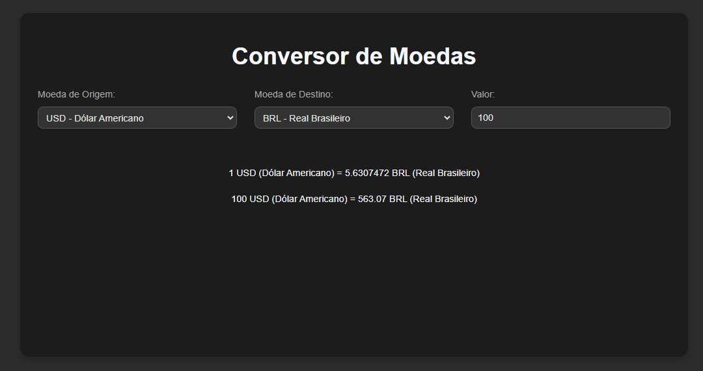

# Conversor de Moedas

Um conversor de moedas simples que utiliza uma API para obter taxas de câmbio em tempo real e exibe gráficos para visualizar flutuações das taxas.

## Funcionalidades

- **Conversão de Moedas**: Converta valores entre diferentes moedas.
- **Taxas em Tempo Real**: Obtém taxas de câmbio atualizadas via API.

## Tecnologias Utilizadas

- **HTML**: Estrutura da página.
- **CSS**: Estilização e design.
- **JavaScript**: Lógica de conversão e manipulação da API.
- **Bootstrap**: Estilos responsivos e componentes.
- **Axios**: Requisições HTTP para a API.

